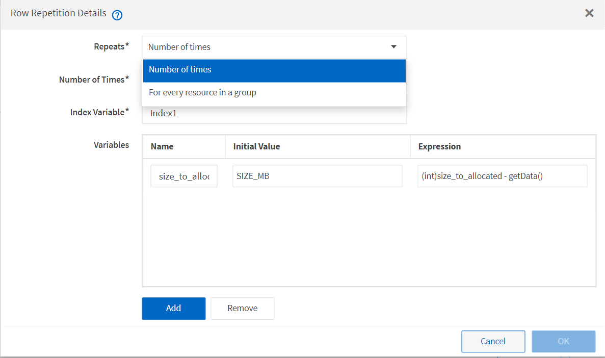

= Wie wiederholen Sie Zeilen funktioniert
:allow-uri-read: 
:icons: font
:imagesdir: ../media/

[role="lead"]
Ein Workflow enthält Befehle und Befehlsdetails, die in Zeilen angeordnet sind. Sie können die Befehle in einer Zeile angeben, die für eine bestimmte Anzahl von Iterationen oder dynamische Anzahl von Iterationen auf der Grundlage der Suchergebnisse wiederholt werden sollen.

Die Befehlsdetails in einer Zeile können angegeben werden, um eine bestimmte Anzahl von Zeitangaben zu wiederholen oder den Workflow zu gestalten. Der Workflow kann auch so gestaltet werden, dass die Anzahl der Wiederholungszeiten der Zeile bei der Ausführung des Workflows oder der Planung für eine Ausführung angegeben werden muss. Sie können Suchkriterien für ein Objekt angeben und die Befehle in einer Zeile können so oft wiederholt werden, wie die Objekte von den Suchkriterien zurückgegeben werden. Zeilen können auch auf Wiederholung gesetzt werden, wenn bestimmte Bedingungen erfüllt sind.

== Variablen für Zeilenwiederholungen

Sie können Variablen in der Variablenliste angeben, die während der Zeilentroiterationen manipuliert werden können. Für die Variablen können Sie einen Namen, einen Wert angeben, mit dem die Variablen initialisiert werden, und einen MVFLEX Expression Language (MVEL) Ausdruck, der nach jeder Wiederholung der Zeile ausgewertet wird.

Die folgende Abbildung zeigt die Optionen für Wiederholungszeilen und ein Beispiel für eine Zeilenwiederholungsvariable:

== Zeilenwiederholung mit Genehmigungspunkten

Wenn Sie Wiederholungszeilen für Befehle und Freigabepunkte angegeben haben, werden alle Iterationen der Befehle vor der Ausführung eines Genehmigungspunkts ausgeführt. Nachdem Sie den Genehmigungspunkt genehmigt haben, wird die Ausführung aller Iterationen der aufeinander folgenden Befehle bis zum nächsten Genehmigungspunkt fortgesetzt.

Die folgende Abbildung zeigt, wie Wiederholungszeilen ausgeführt werden, wenn ein Genehmigungspunkt in einen Workflow eingebunden ist:

image::../media/approval_repetition.png[Wiederholung der Genehmigung]

== Wiederholen Sie Zeilenbeispiele in vordefinierten Workflows

Sie können die folgenden vordefinierten Workflows im Designer öffnen, um zu verstehen, wie wiederholte Zeilen verwendet werden:

* Erstellen eines Clustered Data ONTAP-NFS-Volumes
* Erstellen Sie VMware NFS Datenspeicher auf Clustered Data ONTAP Storage
* Cluster-Peering Einrichten
* Entfernen eines Clustered Data ONTAP Volumes

