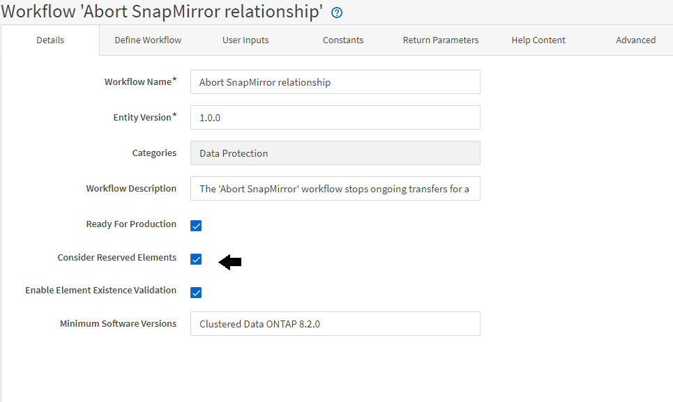

= Wie Reservierung funktioniert
:allow-uri-read: 
:icons: font
:imagesdir: ../media/

[role="lead"]
Die OnCommand Workflow Automation Funktion zur Ressourcenreservierung reserviert die erforderlichen Ressourcen, um sicherzustellen, dass die Ressourcen für die erfolgreiche Ausführung von Workflows zur Verfügung stehen.

Mit den WFA Befehlen können Sie die erforderlichen Ressourcen reservieren und die Reservierung entfernen, nachdem die Ressource in der WFA Cache-Datenbank verfügbar ist – normalerweise nach einer Cache-Erfassung. Die Funktion stellt sicher, dass die reservierten Ressourcen für den Workflow bis zum Ablauf des Reservierungszeitraums verfügbar sind, den Sie in den WFA Konfigurationseinstellungen konfiguriert haben.

Sie können die Reservierungsfunktion verwenden, um während der Ressourcenauswahl von anderen Workflows reservierte Ressourcen auszuschließen. Wenn beispielsweise ein Workflow mit 100 GB Speicherplatz auf einem Aggregat nach einer Woche zur Ausführung geplant ist, Und Sie führen einen weiteren Workflow aus, der den Befehl *Create Volume* verwendet. Der Workflow, der ausgeführt wird, verbraucht nicht den Speicherplatz, der vom geplanten Workflow reserviert wird, um ein neues Volume zu erstellen. Zusätzlich können durch die Reservierungsfunktion Workflows parallel ausgeführt werden.

Wenn ein Workflow zur Ausführung vorab angezeigt wird, berücksichtigt WFA Planner alle reservierten Objekte, einschließlich der bestehenden Objekte in der Cache-Datenbank. Wenn Sie die Reservierung aktiviert haben, werden die Auswirkungen der geplanten Workflows und der parallel ausgeführten Workflows sowie die Existenz von Speicherelementen bei der Planung des Workflows berücksichtigt.

Der Pfeil in der folgenden Abbildung zeigt, dass die Reservierung für den Workflow aktiviert ist:

== Reservierungsbeispiele in vordefinierten Workflows

Sie können die folgenden vordefinierten Workflows im Designer öffnen, um zu verstehen, wie Reservierung verwendet wird:

* Klonumgebung
* Erstellen eines Clustered Data ONTAP Volumes
* Cluster-Peering Einrichten
* Entfernen eines Clustered Data ONTAP Volumes

