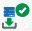

= Fenster „Wörterbuch“
:allow-uri-read: 
:icons: font
:imagesdir: ../media/

[role="lead"]
Das Fenster Wörterbuch zeigt die verfügbaren Wörterbucheinträge in alphabetischer Reihenfolge an.

Ein Glossareintrag ist die Definition eines Objekttyps, der von OnCommand Workflow Automation (WFA) unterstützt wird. Jeder Eintrag aus dem Wörterbuch stellt einen Objekttyp und seine Beziehungen in den Storage- und Storage-Umgebungen dar. Wörterbucheinträge werden in Tabellen in den Datenbanken konvertiert.

NOTE: Abhängig von Ihren Rollen- und Kontoberechtigungen wird dieses Fenster möglicherweise nicht angezeigt.

== Wörterbuchtabelle

In der Tabelle Wörterbuch werden die verfügbaren Wörterbucheinträge aufgeführt. Jeder Eintrag ist wie folgt gekennzeichnet:

* image:../media/community_certification.gif[""] - Inhalt von Nutzern erstellt
* image:../media/ps_certified_icon_wfa.gif[""] - Von Professional Services (PS) entwickelter Inhalt, der nur bei eigenen PS-Installationen verfügbar ist
* image:../media/community_certification.gif[""] - Pakete von Benutzern entwickelt
* image:../media/lock_icon_wfa.gif[""] - Inhalt, der von Benutzern erstellt wurde, die gesperrt sind
* image:../media/netapp_certified.gif[""] - NetApp zertifizierter Inhalte

Sie können die Tabellenanzeige mithilfe der für jede Spalte verfügbaren Filter- und Sortierfunktionen anpassen und die Spaltenreihenfolge neu anordnen.

* image:../media/filter_icon_wfa.gif["Filtersymbol"] Aktiviert oder deaktiviert die Filterung für die gesamte Tabelle. Wenn die Filterung deaktiviert ist, wird über dem Symbol ein rotes „x“ angezeigt.
* Doppelklicken image:../media/filter_icon_wfa.gif["Filtersymbol"] Löscht die Filterauswahl und setzt sie zurück.
* image:../media/wfa_filter_icon.gif["Filtersymbol"] In jeder Spaltenüberschrift können Sie anhand des Inhalts der Spalten filtern. Klicken Sie Auf image:../media/wfa_filter_icon.gif["Filtersymbol"] In einer Spalte können Sie nach einem bestimmten Element aus der Dropdown-Liste oder nach allen verfügbaren Elementen filtern.
* Durch Klicken auf die Spaltenüberschrift wird die Sortierung zwischen aufsteigender und absteigender Reihenfolge umgeschaltet. Sie können die angewendete Sortierreihenfolge anhand der Sortierpfeile ( identifizierenimage:../media/wfa_sortarrow_up_icon.gif["Sortiersymbol"] Für aufsteigende und image:../media/wfa_sortarrow_down_icon.gif["Sortiersymbol"] Für absteigend).
* Um die Position der Spalten neu zu ordnen, können Sie Spalten per Drag-and-Drop in jeder gewünschten Reihenfolge platzieren. Sie können diese Spalten jedoch nicht ausblenden oder löschen.
* Durch Klicken auf das Textfeld * Suchen* können Sie nach bestimmten Inhalten suchen. Darüber hinaus können Sie mithilfe von unterstützten Operatoren nach dem entsprechenden Spaltentyp, Alphabetic oder Numeric suchen.

Die Tabelle Wörterbuch enthält die folgenden Spalten:

* * Zertifizierung*
+
Gibt an, ob der Wörterbucheintrag vom Benutzer erstellt wurde (image:../media/community_certification.gif[""]), PS (image:../media/ps_certified_icon_wfa.gif[""]), Gemeinschaft (image:../media/community_certification.gif[""]), Benutzer-gesperrt (image:../media/lock_icon_wfa.gif[""]) Oder NetApp zertifiziert (image:../media/netapp_certified.gif[""]).

* *Name*
+
Zeigt den Namen des Wörterbucheintrags an.

* *Schema*
+
Zeigt das Schema an, das mit den Wörterbucheinträgen verknüpft ist. Ein Schema ist eine Sammlung von Wörterbucheinträgen, die Daten enthalten, die für Ihre Umgebung relevant sind. (ein vc-Schema enthält beispielsweise Daten, die für Ihre virtuelle Umgebung relevant sind, z. B. Virtual Machines, Hosts und Datastores.)

* *Entity Version*
+
Zeigt die Versionsnummer des Objekts in an `major.minor.revision` Format – z. B. 1.0.0.

* *Beschreibung*
+
Zeigt die Beschreibung des Wörterbucheintrags an.

* *Akquisition Aktiviert*
+
Zeigt ein Häkchen für die Wörterbucheinträge an, die für die Datenerfassung aktiviert sind.

* *Zuletzt Aktualisiert Am*
+
Zeigt das Datum und die Uhrzeit an, zu der der Eintrag des Wörterbuchs zuletzt aktualisiert wurde.

* *Aktualisiert Von*
+
Zeigt den Namen des Benutzers an, der den Eintrag des Wörterbuchs aktualisiert hat.

* *Gesperrt Von*
+
Zeigt den Namen des Benutzers an, der den Eintrag des Wörterbuchs gesperrt hat.

* * Natürliche Schlüssel*
+
Zeigt die natürlichen Schlüssel an, die mit den Wörterbucheinträgen verknüpft sind.

== Symbolleiste

Die Symbolleiste befindet sich über der Spaltenüberschrift. Sie können die Symbole in der Symbolleiste verwenden, um verschiedene Aktionen durchzuführen. Diese Aktionen können auch über das Kontextmenü im Fenster aufgerufen werden.

* *image:../media/new_wfa_icon.gif["Neues Symbol"] (Neu)*
+
Öffnet das Fenster Neue Wörterbücher, in dem Sie einen neuen Wörterbucheintrag erstellen können.

* *image:../media/edit_wfa_icon.gif["Symbol bearbeiten"] (Bearbeiten)*
+
Öffnet das Fenster Wörterbuch <EntryName> für den Eintrag des ausgewählten Wörterbuchs, mit dem Sie den Eintrag des Wörterbuchs bearbeiten können.

* *image:../media/clone_wfa_icon.gif["Klon-Symbol"] (Klon)*
+
Öffnet das Fenster Neuer Wörterbucheintrag <EntryName>_copy, in dem Sie eine Kopie des ausgewählten Wörterbucheintrags erstellen können.

* *image:../media/lock_wfa_icon.gif["Symbol sperren"] (Sperre)*
+
Öffnet das Bestätigungsdialogfeld für den Eintrag „Wörterbuch sperren“, in dem Sie den Eintrag des ausgewählten Wörterbuchs sperren können.

+
Diese Option ist nur für die von Ihnen erstellten Wörterbucheinträge aktiviert.

* *image:../media/unlock_wfa_icon.gif["Symbol entsperren"] (Entsperren)*
+
Öffnet das Dialogfeld „Bestätigung des Glossareintrags entsperren“, in dem Sie den ausgewählten Eintrag des Wörterbuchs entsperren können.

+
Diese Option ist nur für die gesperrten Wörterbucheinträge aktiviert. Administratoren können Einträge aus dem Wörterbuch freischalten, die von anderen Benutzern gesperrt wurden.

* *image:../media/delete_wfa_icon.gif["Symbol Löschen"] (Löschen)*
+
Öffnet das Bestätigungsdialogfeld „Wörterbuch löschen“, in dem Sie den ausgewählten vom Benutzer erstellten Wörterbucheintrag löschen können.

+

NOTE: Sie können keinen Eintrag im WFA Wörterbuch oder PS-Wörterbuch löschen.

* *image:../media/export_wfa_icon.gif["Symbol „Exportieren“"] (Export)*
+
Ermöglicht das Exportieren des ausgewählten vom Benutzer erstellten Wörterbucheintrags.

+

NOTE: Sie können keinen Eintrag im WFA Wörterbuch oder PS-Wörterbuch exportieren.

* * (Akquisition Aktivieren)*
+
Bietet die Option zum Aktivieren der Cache-Erfassung für den ausgewählten Wörterbucheintrag.

* *image:../media/disable_acquisition_wfa_icon.gif["Symbol „Aufnahme deaktivieren“"] (Akquisition Deaktivieren)*
+
Hiermit können Sie die Cacheerfassung für den ausgewählten Wörterbucheintrag deaktivieren.

* *image:../media/reset_scheme_wfa_icon.gif["Schema-Symbol zurücksetzen"] (Schema Zurücksetzen)*
+
Ermöglicht das Zurücksetzen des Schemas, das dem ausgewählten Glossareintrag zugeordnet ist.

* *image:../media/add_to_pack.png["Zum Pack-Symbol hinzufügen"] (Zum Paket Hinzufügen)*
+
Öffnet das Dialogfeld „Add to Pack Dictionary“, in dem Sie den Eintrag des Wörterbuchs und seine zuverlässigen Elemente zu einem Paket hinzufügen können, das bearbeitbar ist.

+

NOTE: Die Funktion Add to Pack ist nur für die Wörterbucheinträge aktiviert, für die die Zertifizierung auf *Keine.* eingestellt ist

* *image:../media/remove_from_pack.png["Aus Packungssymbol entfernen"] (Aus Packung Entfernen)*
+
Öffnet das Dialogfeld aus dem Paket entfernen für den Eintrag des ausgewählten Wörterbuchs, mit dem Sie den Wörterbucheintrag löschen oder aus dem Paket entfernen können.

+

NOTE: Die Funktion „aus Pack entfernen“ ist nur für Wörterbucheinträge aktiviert, für die die Zertifizierung auf *Keine.* eingestellt ist

* *image:../media/inventory.png[""] (Inventar)*
+
Öffnet das Dialogfeld „Inventar“ für den Eintrag des ausgewählten Wörterbuchs, in dem die Tabellendaten angezeigt werden können.

